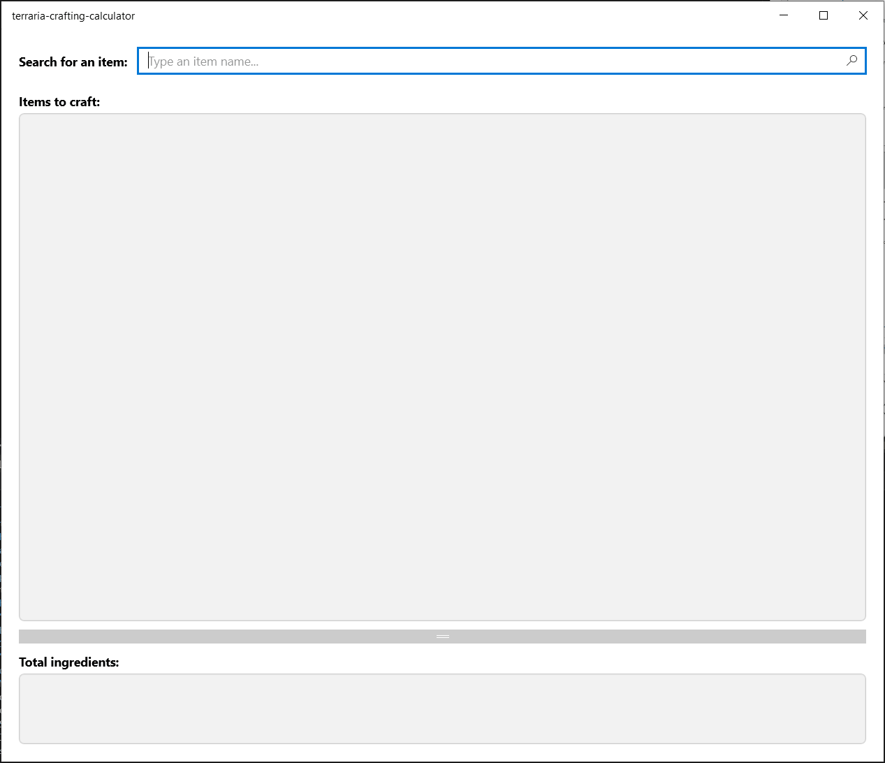

# Terraria Crafting Calculator

A small app to avoid the hasle of having to do recipe calculations on your own when playing Terraria.

Search for the recipes you want to craft, type the amount of times you want to craft the recipes, and let the app calculate the total amounts of ingredients you need to craft them.

# Development information

This application has been developed using the .NET platform, as a [Universal Windows Application (UWP)](https://docs.microsoft.com/en-us/windows/uwp/get-started/universal-application-platform-guide).

Recipes are searched in [the Official Terraria Wiki](https://terraria.fandom.com/). This is done via [web scraping](https://en.wikipedia.org/wiki/Web_scraping), by using [AngleSharp](https://anglesharp.github.io/) under the hood.

Extended/Improved UWP controls are made available via the [Windows Community Toolkit](https://docs.microsoft.com/en-us/windows/communitytoolkit/) and [Windows UI Library 2](https://docs.microsoft.com/en-us/windows/apps/winui/winui2/) projects.